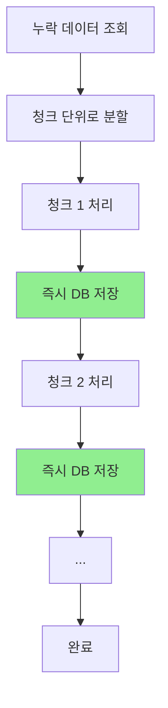

# 🔄 누락 데이터 스트리밍 처리 개선

## 📋 문제 인식

기존 누락 데이터 처리 방식에서 **메모리 효율성 문제**를 발견했습니다:

### ❌ **기존 방식의 문제점**
```python
# 모든 데이터를 메모리에 수집
all_batch_data = []
for future in futures:
    chunk_batch_data = future.result()[2]
    all_batch_data.extend(chunk_batch_data)  # 🔥 메모리에 누적

# 마지막에 한 번에 처리
await self._process_large_batch_insert(all_batch_data, query_column)
```

**문제점:**
- 🚫 대용량 누락 데이터 시 메모리 부족 위험
- 🚫 처리 중간에 실패하면 모든 작업 손실
- 🚫 진행률을 실시간으로 확인하기 어려움

---

## ✅ 개선된 스트리밍 방식

### 🚀 **새로운 처리 흐름**



### 🔧 **핵심 개선사항**

#### 1️⃣ **메모리 효율적 스트리밍**
```python
# 청크별 순차 처리 - 즉시 적재 방식
for chunk_idx, chunk in enumerate(chunks):
    # 청크 처리
    chunk_processed, chunk_skipped, chunk_batch_data = self._process_missing_chunk_sync(...)
    
    # 🔥 즉시 데이터베이스에 적재 (메모리에 누적하지 않음)
    if chunk_batch_data:
        await self._process_immediate_batch_insert(chunk_batch_data, ...)
```

#### 2️⃣ **실시간 진행률 표시**
```python
print(f"🔄 청크 {chunk_idx + 1}/{len(chunks)} 처리 중...")
print(f"✅ 청크 {chunk_idx + 1} 완료: {chunk_processed}개 처리, {chunk_skipped}개 스킵")
```

#### 3️⃣ **안전한 오류 처리**
```python
try:
    success_count = await self.db_manager.execute_batch_insert(insert_query, data_list)
except Exception as e:
    # 실패 시 개별 INSERT로 재시도
    await self._fallback_individual_insert(data_list, insert_query, query_column)
```

---

## 📊 성능 비교

| 항목 | 기존 방식 | 개선된 방식 |
|------|-----------|-------------|
| **메모리 사용량** | O(n) - 모든 데이터 | O(batch_size) - 고정 |
| **실패 시 손실** | 전체 작업 손실 | 해당 청크만 손실 |
| **진행률 확인** | 마지막에만 | 실시간 |
| **중단 후 재시작** | 처음부터 | 처리된 부분 스킵 가능 |
| **데이터베이스 부하** | 마지막에 몰림 | 균등하게 분산 |

---

## 🔧 사용법

### 기본 사용법 (변경 없음)
```bash
# 고급 누락 데이터 처리
python run_missing_data_advanced.py 2025-06-11 2025-06-19

# Docker 환경
docker-compose exec keyword-batch python run_missing_data_advanced.py 2025-06-11 2025-06-19
```

### 새로운 로그 출력 예시
```
🚀 누락 데이터 병렬 처리 시작: 1000개 항목 (스트리밍 모드)
📦 총 10개 청크를 순차 처리합니다 (메모리 효율적 방식)
🔄 청크 1/10 처리 중...
💾 청크 1/10 즉시 INSERT: 95개 레코드
   ✅ 95개 레코드 성공적으로 저장
✅ 청크 1 완료: 95개 처리, 5개 스킵
🔄 청크 2/10 처리 중...
...
```

---

## 💡 추가 개선사항

### 🔄 **Fallback 개별 INSERT**
배치 INSERT 실패 시 개별 INSERT로 자동 전환:

```python
async def _fallback_individual_insert(self, data_list, insert_query, query_column):
    """배치 INSERT 실패 시 개별 INSERT로 처리"""
    for idx, params in enumerate(data_list):
        try:
            # 키워드 길이 최종 안전장치
            if len(str(params['keyword'])) > 100:
                params['keyword'] = str(params['keyword'])[:98] + "..."
            
            await self.db_manager.execute_query(insert_query, params)
        except Exception as e:
            print(f"❌ 개별 INSERT 실패 ({idx + 1}): {e}")
```

### 🛡️ **안전장치**
- 키워드 길이 초과 시 자동 자르기
- 청크 간 대기 시간으로 DB 부하 방지
- 상세한 오류 로깅

---

## 🎯 결론

**누락 데이터 처리가 이제 더 안전하고 효율적입니다:**

✅ **메모리 효율성**: 대용량 데이터도 안전하게 처리  
✅ **실시간 모니터링**: 진행률을 실시간으로 확인 가능  
✅ **오류 복구**: 부분 실패 시에도 안전하게 복구  
✅ **데이터베이스 친화적**: 부하를 균등하게 분산  

이제 **수천 개의 누락 데이터도 안전하게 처리**할 수 있습니다! 🚀 