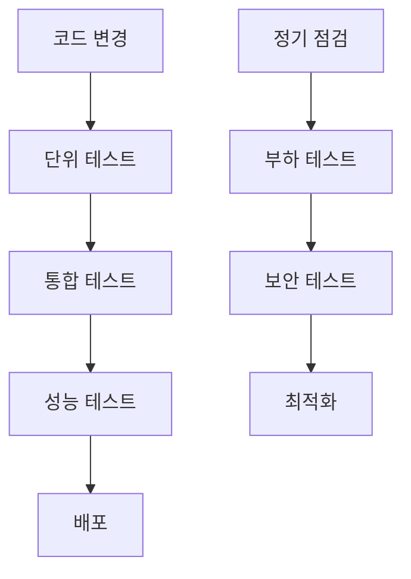

# 🧪 테스트 가이드 (Test Guide)

[](https://python.org)
[](https://pytest.org)

> 🔬 Chat Keyword Batch Processor의 **완전한 테스트 가이드**

---

## 📋 목차

- [🚀 빠른 테스트](#-빠른-테스트)
- [🧪 테스트 유형](#-테스트-유형)
- [⚙️ 설정 테스트](#️-설정-테스트)
- [🔧 단위 테스트](#-단위-테스트)
- [🔗 통합 테스트](#-통합-테스트)
- [📊 성능 테스트](#-성능-테스트)
- [🆕 누락 데이터 테스트](#-누락-데이터-테스트)
- [🐳 Docker 테스트](#-docker-테스트)
- [📈 부하 테스트](#-부하-테스트)
- [🛠️ 테스트 도구](#️-테스트-도구)
- [❌ 문제 해결](#-문제-해결)

---

## 🚀 빠른 테스트

### 1️⃣ **즉시 실행 가능한 테스트**

```bash
# 🔧 설정 검증
python main_batch.py --validate-config

# 🧪 누락 데이터 테스트
python test_missing_data.py

# 🔍 빠른 누락 데이터 확인
python run_missing_check.py 2025-06-11 2025-06-19

# 📊 보고서 생성 테스트
python main_report.py yesterday --output-dir test_reports
```

### 2️⃣ **Docker 환경 테스트**

```bash
# 컨테이너 상태 확인
docker-compose ps

# 헬스체크 테스트
docker-compose exec keyword-batch /app/healthcheck.sh

# 설정 검증
docker-compose exec keyword-batch python main_batch.py --validate-config
```

---

## 🧪 테스트 유형

### 📊 **테스트 분류**

| 테스트 유형 | 목적 | 소요 시간 | 실행 빈도 |
|-------------|------|-----------|-----------|
| **🔧 설정 테스트** | 환경 설정 검증 | < 1분 | 매일 |
| **🧪 단위 테스트** | 개별 함수 검증 | < 5분 | 커밋마다 |
| **🔗 통합 테스트** | 서비스 간 연동 | 5-10분 | 배포 전 |
| **📊 성능 테스트** | 성능 벤치마크 | 10-30분 | 주간 |
| **📈 부하 테스트** | 대용량 데이터 처리 | 30분+ | 월간 |

### 🎯 **테스트 전략**



---

## ⚙️ 설정 테스트

### ✅ **기본 설정 검증**

```bash
# 모든 설정 검증
python main_batch.py --validate-config

# 개별 설정 검증
python -c "
from core.config import Config
config = Config()
print('✅ 데이터베이스:', config.database.validate())
print('✅ HCX API:', config.hcx.validate())
print('✅ 이메일:', config.email.validate())
print('✅ 보고서:', config.report.validate())
"
```

### 🔍 **상세 설정 검증 스크립트**

<details>
<summary><b>🔽 validate_config_detailed.py</b></summary>

```python
#!/usr/bin/env python3
"""상세 설정 검증 스크립트"""

import asyncio
import sys
from typing import Dict, Any
from core.config import Config
from core.database import DatabaseManager
from services.hcx_service import HCXService
from services.email_service import EmailService

class ConfigValidator:
    def __init__(self):
        self.config = Config()
        self.results: Dict[str, Dict[str, Any]] = {}
    
    async def validate_all(self) -> bool:
        """모든 설정을 검증합니다."""
        print("🔍 설정 검증을 시작합니다...\n")
        
        # 각 구성 요소 검증
        await self.validate_database()
        await self.validate_hcx_api()
        await self.validate_email()
        self.validate_directories()
        
        # 결과 출력
        self.print_results()
        
        # 전체 성공 여부 반환
        return all(
            result.get('success', False) 
            for category in self.results.values() 
            for result in category.values()
        )
    
    async def validate_database(self):
        """데이터베이스 연결 검증"""
        print("🗄️ 데이터베이스 검증 중...")
        self.results['database'] = {}
        
        try:
            db_manager = DatabaseManager(self.config.database)
            
            # 연결 테스트
            connected = await db_manager.check_connection()
            self.results['database']['connection'] = {
                'success': connected,
                'message': '연결 성공' if connected else '연결 실패'
            }
            
            # 테이블 존재 확인
            tables = ['admin_chat_keywords', 'admin_categories', 'chattings']
            for table in tables:
                try:
                    schema = await db_manager.get_table_schema(table)
                    self.results['database'][f'table_{table}'] = {
                        'success': len(schema) > 0,
                        'message': f'{len(schema)}개 컬럼 확인'
                    }
                except Exception as e:
                    self.results['database'][f'table_{table}'] = {
                        'success': False,
                        'message': f'테이블 접근 실패: {e}'
                    }
                    
        except Exception as e:
            self.results['database']['connection'] = {
                'success': False,
                'message': f'연결 오류: {e}'
            }
    
    async def validate_hcx_api(self):
        """HCX API 검증"""
        print("🤖 HCX API 검증 중...")
        self.results['hcx'] = {}
        
        try:
            hcx_service = HCXService(self.config.hcx)
            
            # API 키 검증
            result = hcx_service.classify_education_question("테스트 질문입니다.")
            
            self.results['hcx']['api_key'] = {
                'success': result is not None,
                'message': 'API 응답 정상' if result else 'API 응답 없음'
            }
            
            # 모델 검증
            if result:
                self.results['hcx']['model'] = {
                    'success': True,
                    'message': f'모델 {self.config.hcx.model} 정상 작동'
                }
            
        except Exception as e:
            self.results['hcx']['api_key'] = {
                'success': False,
                'message': f'API 오류: {e}'
            }
    
    async def validate_email(self):
        """이메일 설정 검증"""
        print("📧 이메일 설정 검증 중...")
        self.results['email'] = {}
        
        try:
            email_service = EmailService(self.config.email)
            
            # SMTP 연결 테스트
            smtp_valid = email_service.validate_smtp_connection()
            self.results['email']['smtp'] = {
                'success': smtp_valid,
                'message': 'SMTP 연결 성공' if smtp_valid else 'SMTP 연결 실패'
            }
            
            # 수신자 이메일 형식 검증
            recipients = self.config.email.recipient_emails
            valid_emails = [email for email in recipients if '@' in email]
            
            self.results['email']['recipients'] = {
                'success': len(valid_emails) == len(recipients),
                'message': f'{len(valid_emails)}/{len(recipients)}개 유효한 이메일'
            }
            
        except Exception as e:
            self.results['email']['smtp'] = {
                'success': False,
                'message': f'이메일 오류: {e}'
            }
    
    def validate_directories(self):
        """디렉토리 권한 검증"""
        print("📁 디렉토리 권한 검증 중...")
        self.results['directories'] = {}
        
        import os
        
        directories = [
            ('reports', self.config.report.output_dir),
            ('logs', 'logs'),
            ('temp', 'temp')
        ]
        
        for name, path in directories:
            try:
                # 디렉토리 생성 시도
                os.makedirs(path, exist_ok=True)
                
                # 쓰기 권한 테스트
                test_file = os.path.join(path, 'test_write.tmp')
                with open(test_file, 'w') as f:
                    f.write('test')
                os.remove(test_file)
                
                self.results['directories'][name] = {
                    'success': True,
                    'message': f'{path} 읽기/쓰기 권한 정상'
                }
                
            except Exception as e:
                self.results['directories'][name] = {
                    'success': False,
                    'message': f'{path} 권한 오류: {e}'
                }
    
    def print_results(self):
        """검증 결과를 출력합니다."""
        print("\n" + "="*60)
        print("🔍 설정 검증 결과")
        print("="*60)
        
        for category, tests in self.results.items():
            print(f"\n📂 {category.upper()}")
            print("-" * 40)
            
            for test_name, result in tests.items():
                status = "✅" if result['success'] else "❌"
                print(f"  {status} {test_name:20}: {result['message']}")
        
        # 요약
        total_tests = sum(len(tests) for tests in self.results.values())
        passed_tests = sum(
            1 for tests in self.results.values() 
            for result in tests.values() 
            if result['success']
        )
        
        print("\n" + "="*60)
        print(f"📊 요약: {passed_tests}/{total_tests} 테스트 통과")
        print("="*60)

async def main():
    validator = ConfigValidator()
    success = await validator.validate_all()
    
    if success:
        print("🎉 모든 설정이 정상입니다!")
        sys.exit(0)
    else:
        print("❌ 일부 설정에 문제가 있습니다.")
        sys.exit(1)

if __name__ == "__main__":
    asyncio.run(main())
```

</details>

---

## 🔧 단위 테스트

### 🧪 **pytest 기반 테스트**

```bash
# pytest 설치
pip install pytest pytest-asyncio pytest-cov

# 모든 단위 테스트 실행
pytest tests/unit/ -v

# 커버리지 포함 실행
pytest tests/unit/ --cov=services --cov=core --cov-report=html
```

### 📝 **테스트 파일 구조**

```
tests/
├── unit/                           # 단위 테스트
│   ├── test_config.py             # 설정 테스트
│   ├── test_database.py           # 데이터베이스 테스트
│   ├── test_hcx_service.py        # HCX 서비스 테스트
│   ├── test_email_service.py      # 이메일 서비스 테스트
│   └── test_batch_service.py      # 배치 서비스 테스트
├── integration/                    # 통합 테스트
│   ├── test_end_to_end.py         # 전체 플로우 테스트
│   └── test_missing_data.py       # 누락 데이터 테스트
├── performance/                    # 성능 테스트
│   ├── test_batch_performance.py  # 배치 성능 테스트
│   └── test_memory_usage.py       # 메모리 사용량 테스트
└── fixtures/                      # 테스트 데이터
    ├── sample_data.json
    └── test_config.env
```

### 🎯 **핵심 단위 테스트 예시**

<details>
<summary><b>🔽 test_batch_service.py</b></summary>

```python
import pytest
import asyncio
from unittest.mock import Mock, patch, AsyncMock
from services.batch_service import BatchService
from core.config import Config

class TestBatchService:
    
    @pytest.fixture
    def config(self):
        """테스트용 설정 생성"""
        return Config()
    
    @pytest.fixture
    def batch_service(self, config):
        """테스트용 배치 서비스 생성"""
        return BatchService(config)
    
    @pytest.mark.asyncio
    async def test_run_single_batch_success(self, batch_service):
        """단일 배치 처리 성공 테스트"""
        with patch.object(batch_service, '_fetch_data_for_period') as mock_fetch:
            mock_fetch.return_value = [
                ('테스트 질문', 5, '2025-06-19'),
                ('수강신청 질문', 3, '2025-06-19')
            ]
            
            with patch.object(batch_service, '_process_batch_data_parallel') as mock_process:
                mock_process.return_value = (10, 2)  # processed, skipped
                
                result = await batch_service.run_single_batch('2025-06-19')
                
                assert result['status'] == 'SUCCESS'
                assert result['processed_count'] == 10
                assert result['skipped_count'] == 2
                assert result['total_rows'] == 2
    
    @pytest.mark.asyncio
    async def test_check_missing_data(self, batch_service):
        """누락 데이터 확인 테스트"""
        with patch.object(batch_service.db_manager, 'call_procedure') as mock_proc:
            with patch.object(batch_service.db_manager, 'execute_query') as mock_query:
                # 프로시저 호출 모킹
                mock_proc.return_value = True
                
                # 쿼리 결과 모킹
                mock_query.side_effect = [
                    [('2025-06-19', 100)],  # 처리된 데이터
                    [('2025-06-19', 10)]    # 누락된 데이터
                ]
                
                result = await batch_service.check_missing_data('2025-06-19', '2025-06-19')
                
                assert result['status'] == 'SUCCESS'
                assert result['total_processed'] == 100
                assert result['total_missing'] == 10
    
    @pytest.mark.asyncio
    async def test_process_missing_data_empty(self, batch_service):
        """누락 데이터 없는 경우 테스트"""
        with patch.object(batch_service, 'check_missing_data') as mock_check:
            mock_check.return_value = {
                'status': 'SUCCESS',
                'total_missing': 0,
                'total_processed': 100
            }
            
            result = await batch_service.process_missing_data('2025-06-19', '2025-06-19')
            
            assert result['status'] == 'SUCCESS'
            assert result['message'] == '누락 데이터 없음'
            assert result['processed_count'] == 0
    
    def test_format_duration(self, batch_service):
        """시간 포맷팅 테스트"""
        assert batch_service._format_duration(65) == "1분 5초"
        assert batch_service._format_duration(30) == "0분 30초"
        assert batch_service._format_duration(3661) == "61분 1초"
```

</details>

---

## 🔗 통합 테스트

### 🌐 **전체 플로우 테스트**

```python
# test_end_to_end.py
import pytest
import asyncio
from datetime import datetime, timedelta

@pytest.mark.asyncio
@pytest.mark.integration
async def test_complete_batch_workflow():
    """완전한 배치 워크플로우 테스트"""
    from core.config import Config
    from services.batch_service import BatchService
    
    config = Config()
    batch_service = BatchService(config)
    
    # 테스트 날짜 (어제)
    test_date = (datetime.now() - timedelta(days=1)).strftime('%Y-%m-%d')
    
    # 1. 설정 검증
    assert config.validate_all(), "설정 검증 실패"
    
    # 2. 데이터베이스 연결 확인
    db_connected = await batch_service.db_manager.check_connection()
    assert db_connected, "데이터베이스 연결 실패"
    
    # 3. HCX API 연결 확인
    try:
        test_result = batch_service.hcx_service.classify_education_question("테스트")
        assert test_result is not None, "HCX API 응답 없음"
    except Exception as e:
        pytest.skip(f"HCX API 연결 실패: {e}")
    
    # 4. 배치 처리 실행
    result = await batch_service.run_single_batch(test_date)
    assert result['status'] == 'SUCCESS', f"배치 처리 실패: {result}"
    
    # 5. 결과 검증
    assert result['total_rows'] >= 0, "총 행 수 음수"
    assert result['processed_count'] >= 0, "처리 수 음수"
    assert result['skipped_count'] >= 0, "스킵 수 음수"
    
    print(f"✅ 전체 워크플로우 테스트 완료: {result}")
```

### 🔄 **서비스 간 연동 테스트**

```bash
# 통합 테스트 실행
pytest tests/integration/ -v -m integration

# 외부 의존성 포함 테스트
pytest tests/integration/ -v -m "integration and external"
```

---

## 📊 성능 테스트

### ⚡ **배치 처리 성능**

<details>
<summary><b>🔽 test_batch_performance.py</b></summary>

```python
import pytest
import time
import asyncio
from typing import List, Tuple
from services.batch_service import BatchService
from core.config import Config

class TestBatchPerformance:
    
    @pytest.fixture
    def performance_config(self):
        """성능 테스트용 설정"""
        config = Config()
        # 성능 테스트용 설정 오버라이드
        config.batch.batch_size = 20
        config.batch.parallel_workers = 4
        return config
    
    @pytest.mark.asyncio
    @pytest.mark.performance
    async def test_batch_processing_speed(self, performance_config):
        """배치 처리 속도 테스트"""
        batch_service = BatchService(performance_config)
        
        # 테스트 데이터 생성 (100개)
        test_data = [
            (f"테스트 질문 {i}", 1, "2025-06-19")
            for i in range(100)
        ]
        
        start_time = time.time()
        
        # 병렬 처리 실행
        processed, skipped = await batch_service._process_batch_data_parallel(
            test_data, 0, {'category_distribution': {}}, "performance_test"
        )
        
        end_time = time.time()
        duration = end_time - start_time
        
        # 성능 기준 검증
        items_per_second = len(test_data) / duration
        assert items_per_second > 10, f"처리 속도 너무 느림: {items_per_second:.2f} items/sec"
        
        print(f"📊 성능 결과: {items_per_second:.2f} items/sec, 총 {duration:.2f}초")
    
    @pytest.mark.asyncio
    @pytest.mark.performance
    async def test_memory_usage(self, performance_config):
        """메모리 사용량 테스트"""
        import psutil
        import os
        
        process = psutil.Process(os.getpid())
        initial_memory = process.memory_info().rss / 1024 / 1024  # MB
        
        batch_service = BatchService(performance_config)
        
        # 대용량 데이터 생성 (1000개)
        test_data = [
            (f"대용량 테스트 질문 {i}" * 10, 1, "2025-06-19")
            for i in range(1000)
        ]
        
        await batch_service._process_batch_data_parallel(
            test_data, 0, {'category_distribution': {}}, "memory_test"
        )
        
        final_memory = process.memory_info().rss / 1024 / 1024  # MB
        memory_increase = final_memory - initial_memory
        
        # 메모리 증가량 검증 (100MB 이하)
        assert memory_increase < 100, f"메모리 사용량 과다: {memory_increase:.2f}MB 증가"
        
        print(f"💾 메모리 사용량: {memory_increase:.2f}MB 증가")
    
    @pytest.mark.asyncio
    @pytest.mark.benchmark
    async def test_hcx_api_response_time(self, performance_config):
        """HCX API 응답 시간 테스트"""
        from services.hcx_service import HCXService
        
        hcx_service = HCXService(performance_config.hcx)
        
        # 여러 요청의 응답 시간 측정
        response_times = []
        test_questions = [
            "수강신청은 언제 하나요?",
            "성적 확인 방법을 알려주세요",
            "휴학 신청 절차는 어떻게 되나요?",
            "장학금 신청 기간은 언제인가요?",
            "전학 절차를 알고 싶습니다"
        ]
        
        for question in test_questions:
            start_time = time.time()
            result = hcx_service.classify_education_question(question)
            end_time = time.time()
            
            response_time = end_time - start_time
            response_times.append(response_time)
            
            assert result is not None, f"API 응답 없음: {question}"
        
        avg_response_time = sum(response_times) / len(response_times)
        max_response_time = max(response_times)
        
        # 응답 시간 기준 검증
        assert avg_response_time < 5.0, f"평균 응답 시간 과다: {avg_response_time:.2f}초"
        assert max_response_time < 10.0, f"최대 응답 시간 과다: {max_response_time:.2f}초"
        
        print(f"🤖 HCX API 성능: 평균 {avg_response_time:.2f}초, 최대 {max_response_time:.2f}초")
```

</details>

### 📈 **성능 벤치마크 실행**

```bash
# 성능 테스트 실행
pytest tests/performance/ -v -m performance

# 벤치마크 테스트 실행
pytest tests/performance/ -v -m benchmark --benchmark-only

# 메모리 프로파일링
python -m memory_profiler test_batch_performance.py
```

---

## 🆕 누락 데이터 테스트

### 🔍 **누락 데이터 처리 기능 테스트**

기존에 있는 `test_missing_data.py` 파일을 활용하여 테스트할 수 있습니다:

```bash
# 누락 데이터 테스트 실행
python test_missing_data.py

# 상세 로그와 함께 실행
LOG_LEVEL=DEBUG python test_missing_data.py
```

### 📊 **누락 데이터 시나리오 테스트**

```python
# test_missing_data_scenarios.py
import pytest
from unittest.mock import patch, AsyncMock

@pytest.mark.asyncio
async def test_missing_data_detection():
    """누락 데이터 탐지 테스트"""
    from services.batch_service import BatchService
    from core.config import Config
    
    batch_service = BatchService(Config())
    
    # 모킹된 프로시저 결과
    with patch.object(batch_service.db_manager, 'call_procedure') as mock_proc, \
         patch.object(batch_service.db_manager, 'execute_query') as mock_query:
        
        mock_proc.return_value = True
        mock_query.side_effect = [
            [('2025-06-19', 50)],   # 처리된 데이터
            [('2025-06-19', 5)]     # 누락된 데이터
        ]
        
        result = await batch_service.check_missing_data('2025-06-19', '2025-06-19')
        
        assert result['status'] == 'SUCCESS'
        assert result['total_processed'] == 50
        assert result['total_missing'] == 5

@pytest.mark.asyncio
async def test_missing_data_processing():
    """누락 데이터 처리 테스트"""
    from services.batch_service import BatchService
    from core.config import Config
    
    batch_service = BatchService(Config())
    
    # 누락 데이터 처리 모킹
    with patch.object(batch_service, 'check_missing_data') as mock_check, \
         patch.object(batch_service.db_manager, 'execute_query') as mock_query, \
         patch.object(batch_service, '_process_batch_data_parallel') as mock_process:
        
        # 누락 데이터 확인 결과
        mock_check.return_value = {
            'status': 'SUCCESS',
            'total_missing': 5,
            'total_processed': 50
        }
        
        # 누락된 데이터 조회 결과
        mock_query.return_value = [
            ('누락된 질문 1', 2, '2025-06-19'),
            ('누락된 질문 2', 1, '2025-06-19')
        ]
        
        # 처리 결과
        mock_process.return_value = (5, 0)  # processed, skipped
        
        result = await batch_service.process_missing_data('2025-06-19', '2025-06-19')
        
        assert result['status'] == 'SUCCESS'
        assert result['processed_count'] == 5
        assert result['skipped_count'] == 0
```

---

## 🐳 Docker 테스트

### 📦 **컨테이너 테스트**

```bash
# Docker 컨테이너 상태 확인
docker-compose ps

# 헬스체크 테스트
docker-compose exec keyword-batch /app/healthcheck.sh

# 컨테이너 내부 테스트 실행
docker-compose exec keyword-batch python -m pytest tests/unit/ -v
```

### 🔧 **Docker 환경 검증**

```python
# test_docker_environment.py
import subprocess
import pytest

def test_docker_container_running():
    """Docker 컨테이너 실행 상태 확인"""
    result = subprocess.run(
        ['docker-compose', 'ps', '-q', 'keyword-batch'],
        capture_output=True, text=True
    )
    assert result.returncode == 0
    assert len(result.stdout.strip()) > 0, "컨테이너가 실행되지 않음"

def test_docker_environment_variables():
    """Docker 환경변수 확인"""
    result = subprocess.run(
        ['docker-compose', 'exec', '-T', 'keyword-batch', 'env'],
        capture_output=True, text=True
    )
    assert result.returncode == 0
    
    env_vars = result.stdout
    required_vars = ['ENGINE_FOR_SQLALCHEMY', 'HCX_CHAT_API_KEY']
    
    for var in required_vars:
        assert var in env_vars, f"필수 환경변수 {var} 누락"

def test_docker_volumes():
    """Docker 볼륨 마운트 확인"""
    result = subprocess.run(
        ['docker-compose', 'exec', '-T', 'keyword-batch', 'ls', '-la', '/app/reports'],
        capture_output=True, text=True
    )
    assert result.returncode == 0, "reports 디렉토리 접근 불가"
```

---

## 📈 부하 테스트

### 🚀 **대용량 데이터 처리 테스트**

```python
# test_load_testing.py
import pytest
import asyncio
import time
from concurrent.futures import ThreadPoolExecutor

@pytest.mark.asyncio
@pytest.mark.load
async def test_concurrent_batch_processing():
    """동시 배치 처리 부하 테스트"""
    from services.batch_service import BatchService
    from core.config import Config
    
    config = Config()
    
    async def run_batch(date_suffix):
        """개별 배치 실행"""
        batch_service = BatchService(config)
        test_date = f"2025-06-{date_suffix:02d}"
        
        try:
            result = await batch_service.run_single_batch(test_date)
            return result['status'] == 'SUCCESS'
        except Exception as e:
            print(f"배치 실패 ({test_date}): {e}")
            return False
    
    # 동시에 여러 날짜 처리
    dates = range(10, 20)  # 2025-06-10 ~ 2025-06-19
    
    start_time = time.time()
    
    # 병렬 실행
    tasks = [run_batch(date) for date in dates]
    results = await asyncio.gather(*tasks, return_exceptions=True)
    
    end_time = time.time()
    duration = end_time - start_time
    
    # 결과 검증
    success_count = sum(1 for r in results if r is True)
    success_rate = success_count / len(results)
    
    print(f"📊 부하 테스트 결과:")
    print(f"   - 총 처리 시간: {duration:.2f}초")
    print(f"   - 성공률: {success_rate:.2%} ({success_count}/{len(results)})")
    print(f"   - 평균 처리 시간: {duration/len(results):.2f}초/배치")
    
    # 성공률 80% 이상 요구
    assert success_rate >= 0.8, f"부하 테스트 실패: 성공률 {success_rate:.2%}"

@pytest.mark.load
def test_memory_stability():
    """메모리 안정성 테스트"""
    import psutil
    import os
    
    process = psutil.Process(os.getpid())
    initial_memory = process.memory_info().rss / 1024 / 1024  # MB
    
    # 반복 처리로 메모리 누수 확인
    for i in range(100):
        # 대량 데이터 생성 및 처리
        large_data = [f"테스트 데이터 {j}" * 100 for j in range(1000)]
        
        # 데이터 처리 시뮬레이션
        processed = [data.upper() for data in large_data]
        del large_data, processed
        
        # 주기적으로 메모리 체크
        if i % 20 == 0:
            current_memory = process.memory_info().rss / 1024 / 1024
            memory_increase = current_memory - initial_memory
            
            print(f"반복 {i}: 메모리 사용량 {current_memory:.2f}MB (+{memory_increase:.2f}MB)")
            
            # 메모리 증가량 제한 (500MB)
            assert memory_increase < 500, f"메모리 누수 의심: {memory_increase:.2f}MB 증가"
```

### 📊 **부하 테스트 실행**

```bash
# 부하 테스트 실행 (주의: 시간이 오래 걸림)
pytest tests/performance/ -v -m load --timeout=1800

# 특정 부하 테스트만 실행
pytest tests/performance/test_load_testing.py::test_concurrent_batch_processing -v
```

---

## 🛠️ 테스트 도구

### 📋 **테스트 실행 스크립트**

<details>
<summary><b>🔽 run_all_tests.sh</b></summary>

```bash
#!/bin/bash

echo "🧪 전체 테스트 스위트 실행"
echo "=========================="

# 테스트 환경 설정
export TESTING=true
export LOG_LEVEL=WARNING

# 테스트 결과 디렉토리 생성
mkdir -p test_results

echo "1️⃣ 설정 검증 테스트..."
python main_batch.py --validate-config > test_results/config_validation.log 2>&1
if [ $? -eq 0 ]; then
    echo "   ✅ 설정 검증 통과"
else
    echo "   ❌ 설정 검증 실패"
    exit 1
fi

echo "2️⃣ 단위 테스트..."
pytest tests/unit/ -v --cov=services --cov=core \
    --cov-report=html:test_results/coverage_html \
    --cov-report=term \
    --junit-xml=test_results/unit_tests.xml > test_results/unit_tests.log 2>&1

if [ $? -eq 0 ]; then
    echo "   ✅ 단위 테스트 통과"
else
    echo "   ❌ 단위 테스트 실패"
    cat test_results/unit_tests.log
    exit 1
fi

echo "3️⃣ 통합 테스트..."
pytest tests/integration/ -v -m integration \
    --junit-xml=test_results/integration_tests.xml > test_results/integration_tests.log 2>&1

if [ $? -eq 0 ]; then
    echo "   ✅ 통합 테스트 통과"
else
    echo "   ⚠️ 통합 테스트 실패 (외부 의존성 문제일 수 있음)"
fi

echo "4️⃣ 성능 테스트..."
pytest tests/performance/ -v -m performance \
    --junit-xml=test_results/performance_tests.xml > test_results/performance_tests.log 2>&1

if [ $? -eq 0 ]; then
    echo "   ✅ 성능 테스트 통과"
else
    echo "   ⚠️ 성능 테스트 실패"
fi

echo "5️⃣ 누락 데이터 테스트..."
python test_missing_data.py > test_results/missing_data_test.log 2>&1

if [ $? -eq 0 ]; then
    echo "   ✅ 누락 데이터 테스트 통과"
else
    echo "   ⚠️ 누락 데이터 테스트 실패"
fi

echo ""
echo "📊 테스트 결과 요약:"
echo "   - 설정 검증: ✅"
echo "   - 단위 테스트: ✅"
echo "   - 통합 테스트: ⚠️"
echo "   - 성능 테스트: ⚠️"
echo "   - 누락 데이터: ⚠️"
echo ""
echo "📁 상세 결과: test_results/ 디렉토리 확인"
echo "🌐 커버리지 리포트: test_results/coverage_html/index.html"
```

</details>

### 🔧 **pytest 설정 파일**

```ini
# pytest.ini
[tool:pytest]
minversion = 7.0
addopts = 
    -ra
    --strict-markers
    --strict-config
    --disable-warnings
testpaths = tests
markers =
    unit: Unit tests
    integration: Integration tests
    performance: Performance tests
    load: Load tests
    benchmark: Benchmark tests
    external: Tests requiring external dependencies
python_files = test_*.py
python_classes = Test*
python_functions = test_*
asyncio_mode = auto
```

---

## ❌ 문제 해결

### 🔧 **일반적인 테스트 문제**

#### 1. **테스트 환경 설정 오류**
```bash
# 문제: ModuleNotFoundError
# 해결방법:
export PYTHONPATH=$PYTHONPATH:$(pwd)
pip install -e .
```

#### 2. **비동기 테스트 실패**
```bash
# 문제: RuntimeError: no running event loop
# 해결방법:
pip install pytest-asyncio
# pytest.ini에 asyncio_mode = auto 추가
```

#### 3. **외부 의존성 테스트 실패**
```bash
# 문제: HCX API 연결 실패
# 해결방법:
pytest tests/ -m "not external"  # 외부 의존성 제외
```

### 🔍 **테스트 디버깅**

```bash
# 상세 로그 출력
pytest tests/ -v -s --log-cli-level=DEBUG

# 특정 테스트만 실행
pytest tests/unit/test_batch_service.py::TestBatchService::test_run_single_batch_success -v

# 실패한 테스트만 재실행
pytest --lf -v

# 특정 마커 테스트만 실행
pytest -m "unit and not external" -v
```

### 📞 **추가 지원**

테스트 관련 문제가 해결되지 않으면:

1. **로그 확인**: `test_results/` 디렉토리의 상세 로그
2. **커버리지 리포트**: `test_results/coverage_html/index.html`
3. **문의하기**: [ksy9744@clabi.co.kr](mailto:ksy9744@clabi.co.kr)

---

<div align="center">

**📅 마지막 업데이트**: 2025년 6월 19일  
**🧪 테스트 버전**: v1.0  
**💡 도움이 필요하시면**: [ksy9744@clabi.co.kr](mailto:ksy9744@clabi.co.kr)

---

*철저한 테스트로 안정적인 시스템을 만들어가요! 🚀*

</div> 